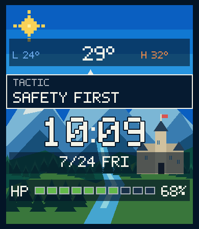

# Pixel Wayfarer Face

Amazfit Bip 6専用の、オリジナル8-bit RPG風Zepp OS文字盤です。時刻の視認性を最優先し、天候背景、最低・現在・最高気温、英語マイクロコピー、バッテリーを表す10分割HPゲージ、AODを表示します。



## 対象端末と実行環境

- 対象: Amazfit Bip 6
- 解像度: 390 × 450 px
- Zepp OS: 5.0
- API_LEVEL: 4.2
- deviceSource: `9765120`、`9765121`、`10158337`
- Zeus CLI: `1.9.3`
- Node.js: 14以上（開発確認は20.18.1）

端末情報はZepp OS公式の[Device Basic Information](https://docs.zepp.com/docs/reference/related-resources/device-list/)を基準にしています。

## セットアップ

```sh
npm install
npm run assets
npm run check
```

Zeus CLI 1.9.3の公開パッケージには、ESM専用の推移依存をCommonJSで読み込む問題があります。このプロジェクトは再現可能なビルドのため、`package.json`の`overrides`で`package-json@7.0.0`と`ora@5.4.1`を固定しています。

## 開発・ビルド

```sh
# Zepp OS Simulatorへ接続して開発
npm run dev

# .zabをdist/へ生成
npm run build

# 純粋ロジックのテスト
npm run check

# PNGアセットとプレビューを再生成
npm run assets
```

Simulatorを起動してから`npm run dev`を実行し、390×450のBip 6を選択してください。SimulatorのSensorsで時刻、バッテリー、天候を切り替えて確認します。公式手順は[Simulator](https://docs.zepp.com/docs/guides/tools/simulator/interface/)を参照してください。

## 実機インストール

1. Zeppアプリで「プロフィール → 設定 → バージョン情報」を開き、Zeppロゴを7回タップしてDeveloper Modeを有効にします。
2. PCで`npm run preview`を実行し、Bip 6ターゲットを選択します。
3. ZeppアプリのDeveloper ModeにあるScanでQRコードを読み取ります。
4. 通常表示、AOD、12/24時間、摂氏/華氏、天候同期、設定変更を実機で確認します。

詳細は公式の[Zepp App Developer Mode](https://docs.zepp.com/docs/v2/guides/tools/zepp-app/)と[Zeus CLI](https://docs.zepp.com/docs/guides/tools/cli/overview/)を参照してください。`preview`にはZepp開発者アカウントへのログインと接続済みBip 6が必要です。

## 構成

```text
app.json                 Bip 6、API_LEVEL、Watchface/Side Service/Settings設定
watchface/index.js       通常表示、センサー購読、更新処理
watchface/layout.js      全座標・寸法
watchface/theme.js       色・文字サイズ
watchface/weather.js     天候コード、昼夜、フォールバック
watchface/battery.js     クランプ、10分割HP、状態色
watchface/copy.js        6種類のマイクロコピー
watchface/aod.js         AOD専用描画
watchface/time-sprites.js 可変幅を抑えた画像数字描画
setting/index.js         Zeppアプリ内プリセット設定
app-side/index.js        Settings StorageとBLE同期
tools/generate-assets.mjs オリジナルPNG生成
assets/bip-6/images/     パッケージ対象アセット
tests/                   バッテリー、天候、コピーのテスト
```

## 表示と更新

- 時刻: システムの12/24時間設定に追従。分をゼロ埋めし、12時間制ではAM/PMを表示
- 日付: `M/D DDD`形式、英語大文字曜日
- 気温: `WEATHER_LOW`、`WEATHER_CURRENT`、`WEATHER_HIGH`をファームウェアの文字盤データ型へ直接バインド
- バッテリー: `Battery.getCurrent()`を0〜100へクランプし、`ceil(percent / 10)`で10分割
- 天候: 公式Weatherセンサーの当日`index`で背景を選択
- 昼夜: 当日の日の出・日の入りを優先し、欠損時は06:00〜17:59を昼と判定
- AOD: 黒背景に時刻、日付、低輝度HPのみ。秒、天候、装飾、コピーは非表示
- 設定: Settings Storage → Side Service → ZML/BLE → Watchface。受信値は端末ローカルへキャッシュ

分更新、バッテリー変更、文字盤への復帰時だけ必要な表示を更新します。秒タイマーとアニメーションは使用しません。

## 天候コード変換

公式のWeather indexを次のように分類します。

| 背景 | index |
|---|---|
| Clear Day / Night | 3（昼夜判定）、28 |
| Partly Cloudy Day / Cloudy Night | 0（昼夜判定）、26 |
| Cloudy Day / Night | 4（昼夜判定） |
| Rain | 1, 5, 7, 10, 12, 18, 19, 21, 24, 27 |
| Thunderstorm | 15, 20 |
| Snow | 2, 6, 8, 9, 16 |
| Fog / Haze / Dust | 11, 13, 14, 17, 22, 23 |
| Unknown | 25、欠損、範囲外 |

根拠は公式の[Weather Watchface API](https://docs.zepp.com/docs/watchface/api/hmSensor/sensorId/WEATHER/)です。

## 設定項目

現在はMessage presetのみです。

- `TACTIC / SAFETY FIRST`（初期値）
- `MODE / TAKE IT EASY`
- `FOCUS / ONE STEP AT A TIME`
- `MODE / STAY SHARP`
- `FOCUS / KEEP MOVING`
- `TODAY / NO RUSH`

自由入力、温度ラベル切替、Thin Bar HPは将来拡張です。

## アセットとライセンス

- 背景10枚、数字、記号、プレビューは`tools/generate-assets.mjs`が生成する本プロジェクト固有のオリジナル素材です。
- 数字はコードで定義したオリジナル5×7ビットマップ字形です。外部フォントファイルを同梱していません。
- 可変英字にはZepp OS端末のシステムフォントを使用します。
- プロジェクトのコードと生成アセットは[MIT License](LICENSE)です。
- `@zeppos/zml`はApache-2.0、Zeus CLIとZepp OS SDK関連パッケージは各配布物のライセンスに従います。

生成AI画像、既存ゲームのロゴ、キャラクター、UI画像、公式フォントは使用していません。城、地形、天候表現はコードから生成する独自構図です。

## 名称

仮称`Retro Quest Face`は、2026-07-24時点の簡易検索で同名ゲームと近接する商標出願が確認されたため使用していません。現在の名称は`Pixel Wayfarer Face`です。これは正式な商標クリアランスや法律意見ではないため、公開前に対象国・区分で専門家または公式データベースによる再確認が必要です。

## 既知の制限

- 実機Bip 6とZepp OS Simulatorはこの作業環境に接続されていないため、ZABビルドまで確認済み、実機表示とSettings AppのBLE反映は未確認です。
- 現在気温はファームウェアの`WEATHER_CURRENT`へ直接バインドするため、JavaScript側から値を単体テストできません。
- 温度単位はシステム設定へ追従しますが、表示を簡潔にするため摂氏・華氏とも単位画像は`°`です。
- AODの焼き付き対策は発光面積10%未満を意図した固定レイアウトです。端末固有のピクセルシフトはファームウェア動作を実機確認してください。
- `appId`は開発用の仮値です。ストア提出前にZepp Consoleで割り当てられた値へ置き換えてください。
- Zeus CLIの推移依存に既知の監査警告があります。`npm audit fix --force`はCLI互換性を壊すため自動適用していません。

## 公開・提出

1. 実機テスト項目を完了します。
2. Zepp ConsoleでWatchfaceを作成し、割り当てられた`appId`へ更新します。
3. ストア用プレビューが`10:09`であること、権利表示、対象端末を確認します。
4. `npm run assets && npm run check && npm run build`を実行します。
5. `dist/`のZABをZepp Consoleへアップロードし、対象国・英語名・説明・独自制作物の申告を設定します。

提出手順は公式の[How to submit a Watchface](https://docs.zepp.com/docs/distribute/watchface/)を優先してください。
