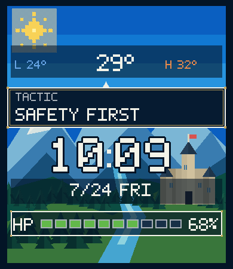

# 165cm Watchfaces

Zepp OS（Amazfit）向けのオリジナル文字盤をまとめたリポジトリです。文字盤ごとに `faces/` の下にフォルダがあり、それぞれ別の文字盤としてビルド・ストア提出できます。

## 文字盤

| 文字盤 | 対象端末 | 状態 | 詳しく |
|---|---|---|---|
| Pixel Wayfarer Face | Amazfit Bip 6（390×450） | ビルド確認済み・実機未確認・ストア未公開 | [faces/pixel-wayfarer](faces/pixel-wayfarer/README.md) |
| SUPER ARBEITER | Amazfit Bip 6（390×450） | ビルド確認済み・実機未確認・自分用 | [faces/super-arbeiter](faces/super-arbeiter/README.md) |

| Pixel Wayfarer Face | SUPER ARBEITER |
|---|---|
|  |  |

## 使い方

コマンドはすべてこのフォルダ（リポジトリの一番上）で実行し、`--` のあとに文字盤の名前（`faces/` の下のフォルダ名）を書きます。

```sh
npm install
npm run check                         # 全文字盤・共通部品のテスト
npm run assets  -- pixel-wayfarer     # 絵（PNG）とプレビューを作り直す
npm run build   -- pixel-wayfarer     # faces/pixel-wayfarer/dist/ に .zab を作る
npm run dev     -- pixel-wayfarer     # Zepp OS Simulator で開く
npm run preview -- pixel-wayfarer     # 実機に入れるための QR を出す
```

文字盤の名前：`pixel-wayfarer`・`super-arbeiter`

## 構成

```text
faces/<文字盤>/     文字盤ごとの Zepp OS プロジェクト（app.json・watchface/・assets/ など一式）
shared/             文字盤どうしで使い回す部品（天気・電池・時刻の数字・曜日・時刻の文字・画像で並べる文字）
tests/              テスト（shared/ と文字盤ごと）
tools/face.mjs      文字盤を名前で選んでビルドなどを動かす道具
docs/               開発のルール・しくみ（AI と人の両方向け）
```

開発のルールは [AGENTS.md](AGENTS.md) と [docs/](docs/) を見てください。

## ライセンス

[MIT License](LICENSE)。依存パッケージは各配布物のライセンスに従います。
