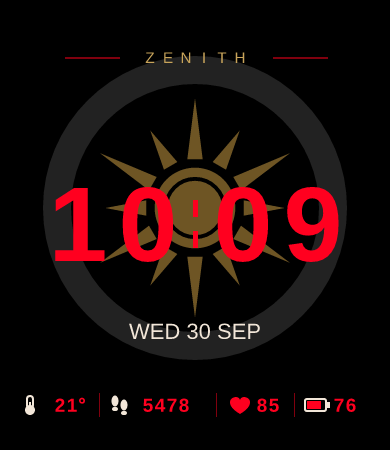
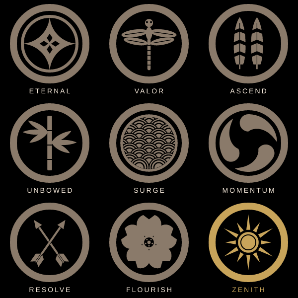

# KAMONT

**KAMONT** ＝「家紋と」＝ KAMON（家紋）＋ Time。家紋をテーマにした、Amazfit Bip 6（390×450）用の文字盤です。腕を上げて画面が点くたびに、輪の中の家紋と、上の英単語（その紋の意味から取ったひとこと）がランダムに替わります。まれに金色のレア紋が出ます。

ユーザーが別の場所で作っていた、ドラマ風の時計のデザイン（配置・色・大きさ）をできるだけそのまま再現し、ストアに出すと問題になる所だけを置き換えました。


| レア（金） | 大きい値 | 電池少なめ・データなし | 画面オフ（AOD） |
|---|---|---|---|
|  |  |  |  |

## 元のデザインから変えた所

元のデザインのプレビューを1pxずつ測り、題字・線・輪・時刻・日付・下の段の位置、色、大きさは同じにしています。変えたのは次の所だけです。

| 元のデザイン | 問題 | KAMONT |
|---|---|---|
| 題字「VIVANT」 | ドラマのタイトル（商標の可能性） | 紋ごとの英単語（同じ字間・同じ位置） |
| 輪の中の六角形と縦の線 | ドラマのマークにそっくり | 家紋9種類（下の表）。太い輪と墨色はそのまま |
| 時刻の数字の字形 | 出どころがわからない | Liberation Sans Bold（SIL Open Font License 1.1）。元と同じ太さ・大きさ（1字 52×76、70px おき） |
| 太陽のアイコン | 天気が変わっても「晴れ」のまま | 温度計 |
| 電池の目盛り（いつも3本） | 残りが変わっても同じ | 枠の中を、残りに合わせて赤く塗る |
| 下の段の数字 | 大きい値ではみ出す（例：「STEP」が切れる） | 気温 `-12°`・歩数 `99999`・心拍 `199`・電池 `100` が入る幅を取った |
| 背景の絵 | 生成AIの画像がもと | すべてコードで描き直した |

- 通知アイコンの所（上のまん中 y 0〜48）には何も描かない（確認図 `docs/check-notification.png`）
- データが無い時（心拍・天気）は「--」
- 画面オフ（AOD）は、暗い赤の時刻と暗い色の日付だけ

## 紋とタイトル（ガチャ）



| 番号 | 紋 | タイトル | 意味（ストアの説明に使える英文） |
|---|---|---|---|
| 0 | 七宝 | ETERNAL | Linked rings that never end |
| 1 | 蜻蛉（とんぼ） | VALOR | The dragonfly only flies forward — the "victory bug" |
| 2 | 並び鷹の羽 | ASCEND | Hawk feathers, the pride of warriors |
| 3 | 竹 | UNBOWED | Bamboo bends in the storm but never breaks |
| 4 | 青海波 | SURGE | Endless waves, always moving on |
| 5 | 三つ巴 | MOMENTUM | Whirling commas of unstoppable force |
| 6 | 違い矢 | RESOLVE | Arrows fly straight to the mark |
| 7 | 桜 | FLOURISH | Blossoms that bloom fully in their moment |
| 8 | 日足（レア・金） | ZENITH | The sun at its highest point |

- 画面が点くたび（腕を上げた時・画面オフから戻った時）に、次の紋をランダムに選ぶ。直前と同じ紋は出さない
- レアの日足は、画面が点くたびに約5%（直前がレアなら出ない）。紋は暗い金、タイトルは明るい金
- 画面が消えている間・1分ごとには替えない（電池のため）。何が出たかは保存しない
- 一覧と確率は `watchface/crests.js`。紋の形は `tools/crest-shapes.mjs`
- タイトルは8文字まで（赤い線の間に収めるため。テストで確かめている）
- 紋はどれも、昔からある形の種類を、この文字盤のために新しく描いたもの。実在の家の紋は写していない。菊・桐・葵・卍・丸に十字・武田菱・三つ鱗・亀甲（元の六角形のマークに近いため）は使わない

## 素材と権利

- 絵（紋・線・アイコン）は `tools/generate-assets.mjs`・`tools/crest-shapes.mjs` の図形から作る。写真・生成AIの画像は使っていない
- 数字とタイトルの文字：Liberation Sans（Bold・Regular、2.1.5）。SIL Open Font License 1.1。フォントのファイルとライセンスは `source/fonts/`（`OFL.txt`）。文字盤の中に入るのは、フォントで描いた数字の画像だけ
- 日付は、時計のシステムの文字で出す（プレビューでは Liberation Sans で近い見た目にしている）
- 元のデザインの名前・マーク・画像は、リポジトリに入れていない

## しくみ

| ファイル | 役割 |
|---|---|
| `app.json` | アプリの設定。`appId` は仮の値（`20261001`） |
| `watchface/index.js` | 文字盤の本体。時刻と日付は分ごとと画面が戻った時に更新。気温・歩数・心拍・電池の数字は時計のデータに直接つなぐ（`TEXT_IMG`）。電池の塗りは電池の変化で更新 |
| `watchface/layout.js` | 座標・大きさ（元のデザインから測った値）・画面の四隅の形 |
| `watchface/theme.js` | 色（元のデザインから測った値） |
| `watchface/crests.js` | 紋とタイトルの一覧、次の紋の選び方（`pickCrest`） |
| `watchface/format.js` | 時刻と日付の文字（`WED 30 SEP`） |
| `watchface/aod.js` | 画面オフ時の表示 |
| `tools/crest-shapes.mjs` | 9種類の紋の形 |
| `tools/generate-assets.mjs` | 背景・紋・タイトル・数字・プレビューの画像を作る |
| `source/fonts/` | 数字を描くフォントとそのライセンス |

絵を変える時は `tools/` を直して、次のコマンドで作り直します（PNG を直接描き換えない）。

```sh
npm run assets -- kamon
```

## 既知の制限

- ユーザーの PC でビルドして動かし、通常表示（時刻・日付・気温・歩数・心拍・電池・通知アイコンとの重なり・四隅）は確かめた。AOD・12時間表示・華氏・データが無い時の「--」・電池が少ない時はまだ
- `app.json` の `appId` は仮の値。Zepp Console で新しく作った値に替える
- 気温の単位は、摂氏・華氏とも「°」だけを出す（時計の設定に従う）
- 12時間表示の時、午前・午後の印は出さない
- 日付は英語だけ（`WED 30 SEP`）
- ストアに出す前に、「KAMONT」に似た名前の商標・アプリがないか確かめる
- 紋の切り替えは、実機ではまだ見ていない

## 実機インストール

ユーザーの PC で：

```sh
npm run preview -- kamon
```

出た QR を、スマホの Zepp アプリの Developer Mode → Scan で読みます。

## 公開・提出

1. 実機で、通常表示・AOD・12/24時間・摂氏/華氏・天気の同期・心拍が無い時の「--」・電池の塗り・四隅で下の段が切れないかを確かめる
2. Zepp Console で文字盤を作り、`app.json` の `appId` をその値にする。名前は `app.json` の `appName` と `i18n`（KAMONT）
3. `npm run assets -- kamon && npm run check && npm run build -- kamon`
4. `faces/kamon/dist/` の ZAB を Zepp Console にアップロードし、対象国・名前・説明・独自制作物の申告を入れる。フォントは OFL であることを書く。説明文に「KAMONT = KAMON (family crest) + Time」と紋の意味を入れる

提出手順は公式の [How to submit a Watchface](https://docs.zepp.com/docs/distribute/watchface/) を優先してください。
