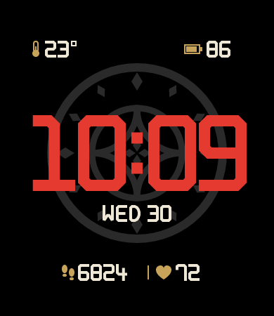
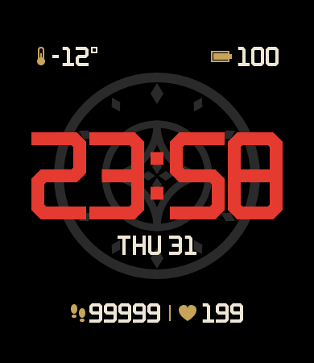
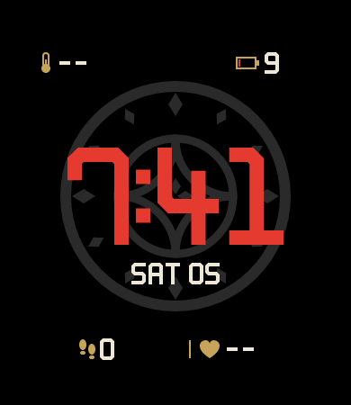
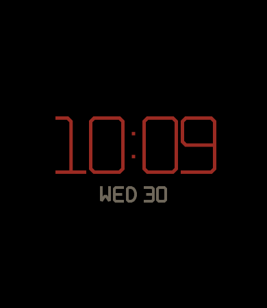

# KAMON（仮の名前）

家紋をテーマにした、Amazfit Bip 6（390×450）用の文字盤です。黒い地に、墨色の紋・朱色の大きな時刻・金のアイコンを置きます。ストアで公開できるよう、絵・数字・文字はすべてこのリポジトリのコードで描いたオリジナルです。



| 大きい値 | 電池少なめ・データなし | 画面オフ（AOD） | 紋 |
|---|---|---|---|
|  |  |  |  |

## 画面

上から：

1. 通知アイコンの余白（上のまん中 y 0〜48 には何も置かない。確認図 `docs/check-notification.png`）
2. 左に気温（温度計）、右に電池（枠の塗りは残りに合わせて変わり、20%以下で朱になる）
3. 紋の上に大きな時刻（朱）。24時間は `09:05`、12時間は `9:05`
4. 曜日（英字3文字）と日（2桁）。例：`WED 30`
5. 下の段：歩数｜心拍

画面オフ（AOD）は、黒い地に細い線の時刻と曜日・日だけ（光る所は画面の10%未満。テストで確かめている）。

## 紋

「丸に十二菱、中に七宝と花菱」。昔からある形（丸・菱・七宝・花菱）を組み合わせて、この文字盤のために作った紋です。

- 十二菱：時計の12の目盛りを小さな菱で表す（3・6・9・12の位置は少し大きい）
- 七宝：円の中に、4つの円の弧でできる四つ星
- 花菱：まん中に4枚の菱の花びら

## 素材と権利

- 絵・数字・英字は、`tools/generate-assets.mjs` と `tools/strokes.mjs` の図形から作る。フォント・写真・生成AIの画像は使っていない
- 数字と英字は「角字」（四角い字）のように、太さのそろった直線で組んだオリジナルの字形
- 実在の家の紋は写していない。菊の紋・桐の紋・葵の紋など、特定の家や国とつながる紋は使わない
- 元にした文字盤（ドラマ風の時計）の名前・マーク・画像・数字は、何も使っていない。そこから引き継いだのは、Bip 6 の技術的な設定（画面の大きさ・通知の余白など）と、「黒い地・大きな赤い時刻・後ろに控えめなマーク・下に1列の情報」という大まかな配置だけ

## しくみ

| ファイル | 役割 |
|---|---|
| `app.json` | アプリの設定。`appId` は仮の値（`20261001`） |
| `watchface/index.js` | 文字盤の本体。時刻・曜日・日は分ごとと画面が戻った時に更新。気温・電池・歩数・心拍の数字は時計のデータに直接つなぐ（`TEXT_IMG`）。電池の塗りは電池の変化で更新 |
| `watchface/layout.js` | 座標・大きさ・紋の位置 |
| `watchface/theme.js` | 色 |
| `watchface/format.js` | 時刻と日の文字（桁のそろえ方） |
| `watchface/aod.js` | 画面オフ時の表示 |
| `tools/strokes.mjs` | 数字 0〜9 と曜日の英字の字形（線の点の並び） |
| `tools/generate-assets.mjs` | 背景・数字・曜日・プレビューの画像を作る |

絵を変える時は `tools/` を直して、次のコマンドで作り直します（PNG を直接描き換えない）。

```sh
npm run assets -- kamon
```

## 既知の制限

- まだ実機 Bip 6・Simulator で見ていない。クラウドの作業環境からは Zepp のサーバーにつながらず、ビルド（`.zab` づくり）も確かめられていない
- `app.json` の `appId` は仮の値。Zepp Console で新しく作った値に替える
- 気温の単位は、摂氏・華氏とも「°」だけを出す（時計の設定に従う）
- 12時間表示の時、午前・午後の印は出さない
- 曜日は英語だけ
- 名前「KAMON」は仮。ストアに出す前に、似た名前の商標がないか確かめる

## 実機インストール

ユーザーの PC で：

```sh
npm run preview -- kamon
```

出た QR を、スマホの Zepp アプリの Developer Mode → Scan で読みます。

## 公開・提出

1. 実機で、通常表示・AOD・12/24時間・摂氏/華氏・天気の同期・心拍が無い時の「--」を確かめる
2. Zepp Console で文字盤を作り、`app.json` の `appId` をその値にする。ストアの名前を決めて `appName` と `i18n` も直す
3. `npm run assets -- kamon && npm run check && npm run build -- kamon`
4. `faces/kamon/dist/` の ZAB を Zepp Console にアップロードし、対象国・名前・説明・独自制作物の申告を入れる

提出手順は公式の [How to submit a Watchface](https://docs.zepp.com/docs/distribute/watchface/) を優先してください。
