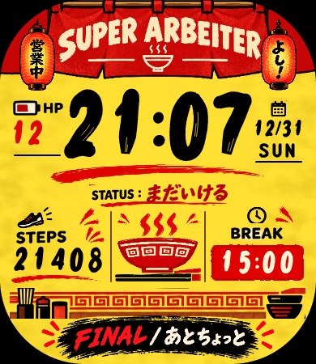
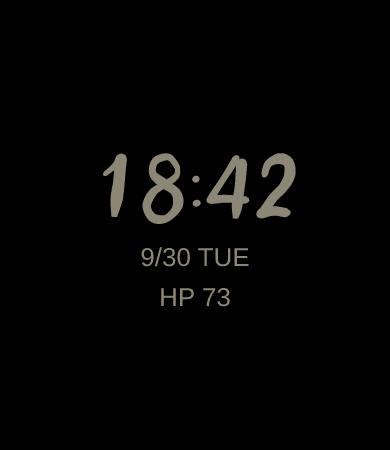

# SUPER ARBEITER

Amazfit Bip 6 用の、ラーメン屋で働くスーパーアルバイターのための「業務ウォッチ」風の文字盤です。黄色い地に赤と黒を効かせ、暖簾・提灯・丼・厨房カウンターで店の空気を出しています。キャラクターは出しません。

| 通常 | 電池少なめ・日曜 | AOD（画面オフ時） |
|---|---|---|
|  |  |  |

## 表示するもの

- 時刻（いちばん大きく。システムの12/24時間設定に合わせる）
- 上：横幅いっぱいの暖簾「SUPER ARBEITER」、その手前に左「営業中」、右「よし!」の提灯
- 時刻：1字ずつ作った筆の数字（入りが太く、終わりを払い、少し前に傾く。大きい時刻だけ、かすれ入り）
- 時刻の左に HP（電池の残り。赤い数字）、右に日付（`9/30`）と曜日（`TUE`）
- 時刻の下：赤い筆の線と `STATUS : まだいける`
- 下の段：左に STEPS（歩数）、真ん中に丼と湯気と箸、右に BREAK（休憩の時刻）
- 赤い勢い線・筆の下線の飾り
- 下：厨房カウンターの飾りと `FINAL / あとちょっと`
- AOD：黒い背景に、時刻・日付・HP だけ（暗いクリーム色）

WATER／MEAL／REST のチェック、タップ操作、アニメーションはありません。更新は分ごと（HP と歩数は時計のデータが変わった時）です。

## BREAK の時刻

赤い BREAK の箱には、スマホの Zepp アプリで入れた休憩の時刻を出します（最初は `15:00`）。

1. Zepp アプリで、この文字盤の設定を開く
2. 「休憩の時刻」に `14:58` のように入れる

時計の側では何も操作しません。休憩のタイマー（BREAK!）や、麺ゆでのタイマー（BOIL!）を作る時は、文字盤とは別の Mini App として作る予定です。

## 使い方（リポジトリの一番上で）

```sh
npm install
npm run assets  -- super-arbeiter   # 絵とプレビューを作り直す（source/ が必要）
npm run check                       # テスト
npm run build   -- super-arbeiter   # faces/super-arbeiter/dist/ に .zab を作る
npm run preview -- super-arbeiter   # 実機に入れるための QR を出す
```

実機に入れる手順は [Pixel Wayfarer の README](../pixel-wayfarer/README.md) の「実機インストール」と同じです。

## 構成（`faces/super-arbeiter/` の中）

```text
app.json                   Bip 6、appId、3つの部分の場所
watchface/index.js         通常表示、分ごとの更新、BREAK の時刻の受け取り
watchface/layout.js        座標・大きさ（四隅の丸みと端12pxを避ける）
watchface/theme.js         色・文字の大きさ
watchface/status.js        STATUS の文言（いまは「まだいける」だけ）
watchface/aod.js           AOD の表示
setting/index.js           Zepp アプリの設定画面（休憩の時刻）
setting/keys.js            設定の保存キーと読み取り
app-side/index.js          設定を時計に送る Side Service
tools/prepare-source.mjs   受け取った素材から、使う部分を切り出して source/ に保存する（1回だけ）
tools/brush-digits.mjs     筆の数字 0〜9 と「:」の字形（1字ずつ、筆の通る点と太さで決めてある）
tools/generate-assets.mjs  source/ と筆の数字から、時計の画像とプレビューを作る
source/                    切り出し・縮小した素材（時計の大きさの2倍）
assets/bip-6/images/       時計に入る画像
docs/                      README 用プレビュー
```

## 素材と権利

- 暖簾・提灯（営業中／よし!）・丼・`FINAL / あとちょっと` の絵と、参考画像（`watchface_reference.png`）は、ユーザーから受け取った制作指示書のパッケージ（`SUPER_ARBEITER_Claude_handoff.zip`、2026-09-30）に入っていた、この文字盤のために生成された絵です。
- `source/` には、そのうち使う部分だけを縮小して入れています。
  - 暖簾・提灯・丼・FINAL は、別々の素材ファイルから
  - HP・STEPS・BREAK・`STATUS : まだいける` の文字、電池・くつ・カレンダー・時計のアイコン、カウンターの飾りは、参考画像から切り出して黄色い地を透明にしたもの
  - 湯気の渦（2種）・赤い勢い線（2種）・筆の下線（2種）は、あとから受け取った飾りの素材（この文字盤のために生成された透過 PNG、2026-09-30）を切り分けたもの
- `docs/reference-600.png` は、参考画像を 600×600 に縮小したものです（見比べ・レビュー用。時計には入りません）。
- 元の素材（合計10MBほど）はリポジトリに入れていません。作り直す時は、次のコマンドを実行します。

```sh
node faces/super-arbeiter/tools/prepare-source.mjs <素材のフォルダ> <飾りの素材.png>
```

- 数字 0〜9 と「:」は、`tools/brush-digits.mjs` で1字ずつ作った独自の筆の字形です。筆の通る点と太さを決めて塗りつぶしの形にし、少し前に傾けています（形は毎回同じ）。既存の書体やフォントは使っていません。
- 曜日の英字・地の黄色・区切りの線・BREAK の赤い箱は、`tools/generate-assets.mjs` でコードから描いています。
- 公式キャラクター・公式ロゴ・公式フォントは使っていません。既存のイラストのトレースや模写もしていません。「ちいかわ」や「ラーメン豚」の名前は、文字盤に出しません。
- 画面の日本語（AOD の日付と HP）は、時計のシステムフォントで出します。

## 既知の制限

- 実機 Bip 6・Simulator では、まだ確認していません。ビルドまで確認済みです。
- `appId`（`20260930`）は仮の値です。自分の時計で使うだけならこのままでも動く見込みですが、ストアに出す時は Zepp Console で作った値に変えてください。
- 12時間制にしている時、AM/PM は表示しません。
- 時刻の左右に HP と日付を置いたため、時刻は参考画像より少し細身です（数字の枠 54×88）。実機で読みにくければ大きさを見直します。
- 四隅の丸みで、提灯のつり金具と FINAL の左右の赤い線が少し欠けます（飾りなので、そのままにしています）。
