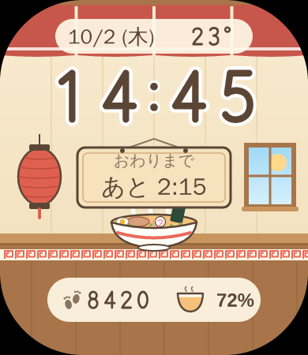
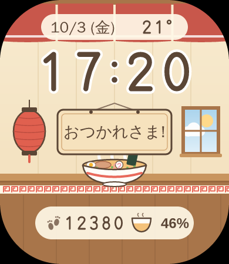
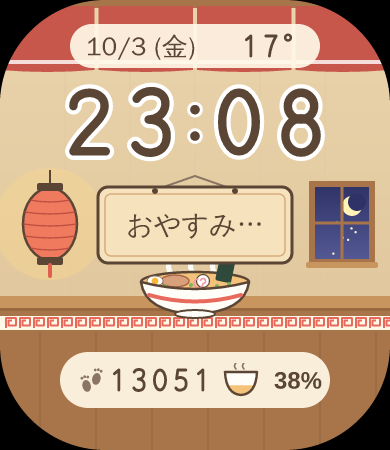
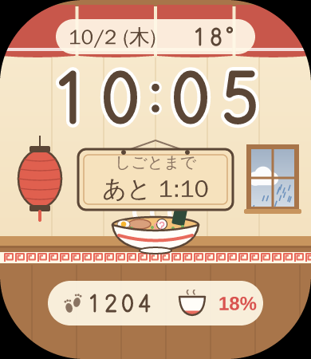

# Yuge Ramen Face（ゆげラーメン）

Amazfit Bip 6 用の、パステルでゆるい手描き風の文字盤です。背景はラーメン屋の店内で、真ん中の木札がバイトのシフトの残り時間を教えてくれます。



| シフト中 | おわったあと | 夜 | 雨・電池少なめ |
|---|---|---|---|
|  |  |  |  |

## 表示するもの

- 時刻（システムの12/24時間設定に合わせる）・日付と曜日（日本語）・いまの気温
- 背景：ラーメン屋の店内（のれん・赤ちょうちん・窓・木のカウンターと湯気の立つラーメン）
- 真ん中の木札
  - シフトはじまりの3時間前から：「しごとまで　あと 1:10」
  - シフト中：「おわりまで　あと 2:15」
  - おわってから2時間：「おつかれさま!」
  - それ以外：時間帯のあいさつ（おはよう・いい ゆげ びより・こんばんは・おやすみ…）
- 歩数・電池（どんぶりのスープの量と%）
- 天気は窓の外の空で表す（晴れ・くもり・雨・雷・雪・霧・夜など10種類）。夜はちょうちんに明かりがともる
- AOD（画面オフ時）：黒い背景に、時刻・日付・シフトの残り時間だけ

## シフトの設定

スマホの Zepp アプリで、この文字盤の設定を開きます。

1. 「文字盤にシフトの残り時間を出す」をオン
2. 「はじまり」と「おわり」に時刻を入れる（例：`11:15` と `17:00`）

最初は 11:15〜17:00 になっています。日をまたぐシフト（例：22:00〜2:00）にも対応しています。設定は曜日ごとには分かれていません。勤務の日ごとに時刻を変えてください。

## 使い方（リポジトリの一番上で）

```sh
npm install
npm run assets  -- yuge-ramen   # 絵とプレビューを作り直す
npm run check                   # テスト
npm run build   -- yuge-ramen   # faces/yuge-ramen/dist/ に .zab を作る
npm run preview -- yuge-ramen   # 実機に入れるための QR を出す
```

実機に入れる手順は [Pixel Wayfarer の README](../pixel-wayfarer/README.md) の「実機インストール」と同じです。

## 構成（`faces/yuge-ramen/` の中）

```text
app.json                  Bip 6、appId、3つの部分の場所
watchface/index.js        通常表示、センサー、分ごとの更新
watchface/shift.js        シフトの残り時間と木札の文の計算
watchface/layout.js       座標・大きさ（四隅の丸みを避ける）
watchface/theme.js        色・文字の大きさ
watchface/aod.js          AOD の表示
setting/index.js          Zepp アプリの設定画面（シフトの時刻）
setting/keys.js           設定の保存キーと読み取り
app-side/index.js         設定を時計に送る Side Service
tools/generate-assets.mjs 絵（店内の背景・数字・小物）をすべて SVG で描いて PNG にする
assets/bip-6/images/      時計に入る画像
docs/                     README 用プレビュー
```

## 絵と権利について

- 数字・背景・小物は、すべて `tools/generate-assets.mjs` でコードから描いたオリジナルです。
- キャラクターは出しません。既存作品のキャラクター・名前・ロゴ・画像、公式フォントは使っていません。お店の名前やロゴのような文字も描いていません。
- パステルの色づかいや、ゆるい手描き風の線といった画風の雰囲気を参考にしています。特定の作品とは関係のない、独立した作品です。
- 数字は線で描いた独自の字形です。日本語の文字は時計のシステムフォントで表示します。
- プレビュー画像の日本語は、作った PC に入っているフォントで描いています。実機とは字の形が少し違います。

## 既知の制限

- 実機 Bip 6・Simulator では、まだ確認していません。ビルドまで確認済みです。
- `appId`（`20260930`）は仮の値です。自分の時計で使うだけならこのままでも動く見込みですが、ストアに出す時は Zepp Console で作った値に変えてください。
- 12時間制にしている時、AM/PM は表示しません。
- 日本語の表示は、時計の言語設定とフォントが日本語に対応している前提です。
- シフトの残り時間は分ごとに更新します（秒は出しません）。
